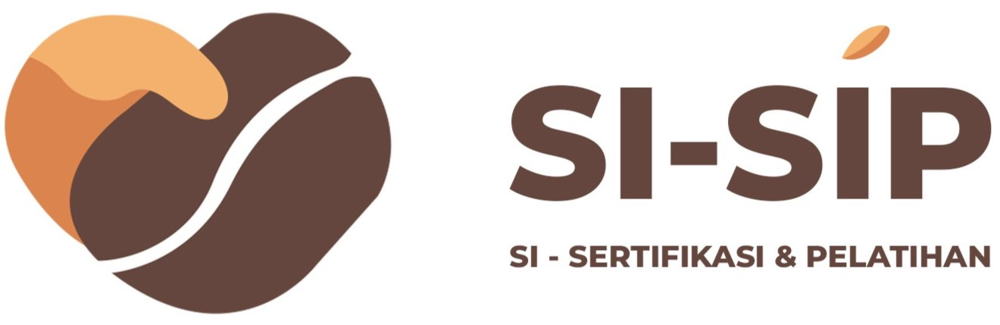

<p align="center">
  
</p>
# ☕ Si-Sip

**Si-Sip** adalah **Sistem Informasi Sertifikasi, Pelatihan, dan Promosi** yang dibuat khusus untuk mendukung para petani kopi.  
Melalui sistem ini, petani kopi dapat:
- Mengajukan sertifikasi halal untuk produk kopi mereka.
- Mengakses informasi video pelatihan, mulai dari proses menanam hingga mengolah kopi.
- Melakukan display produk untuk mempromosikan hasil olahan kopi mereka.

## ✨ Fitur Utama
- **Pengajuan Sertifikasi Halal**: Memudahkan petani untuk mendaftarkan produk mereka.
- **Video Pelatihan**: Edukasi lengkap seputar budidaya dan pengolahan kopi.
- **Promosi Produk**: Showcase produk hasil olahan kopi agar dapat dikenal lebih luas.

## 🛠️ Teknologi yang Digunakan
- **Laravel** – Framework PHP untuk membangun aplikasi web.
- **Blade** – Template engine bawaan Laravel.
- **Bootstrap** – Library CSS untuk desain responsif.

## ⚙️ Instalasi

1. Clone repository ini:
````
   git clone https://github.com/JoF24/Si-Sip
````

2. Import file `coba_ppl.sql` ke dalam database lokal Anda (contoh: phpMyAdmin).
3. Jalankan server lokal, lalu masuk ke direktori project:

   ```bash
   cd Si-Sip
   ```
4. Jalankan perintah berikut untuk menjalankan project Laravel:

   ```bash
   php artisan serve
   ```

Project akan berjalan di `http://localhost:8000` (secara default).

## 📂 Struktur Folder (singkat)

* `app/` – Berisi logika aplikasi (model, controller, dll).
* `resources/views/` – Template Blade.
* `public/` – File publik (gambar, video).
* `routes/` – File routing Laravel.
